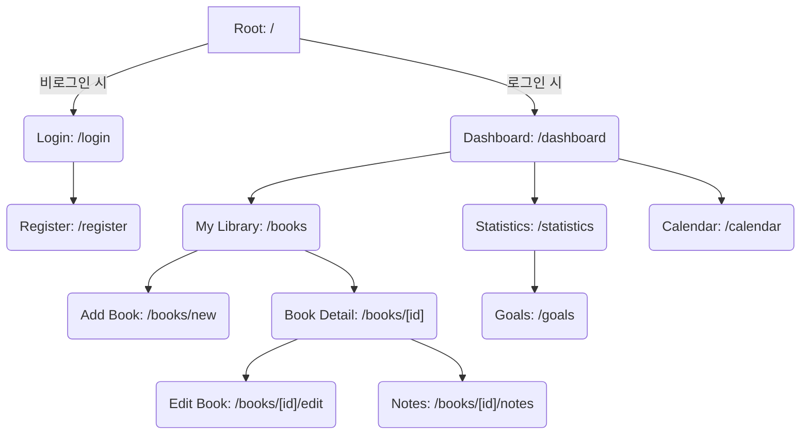
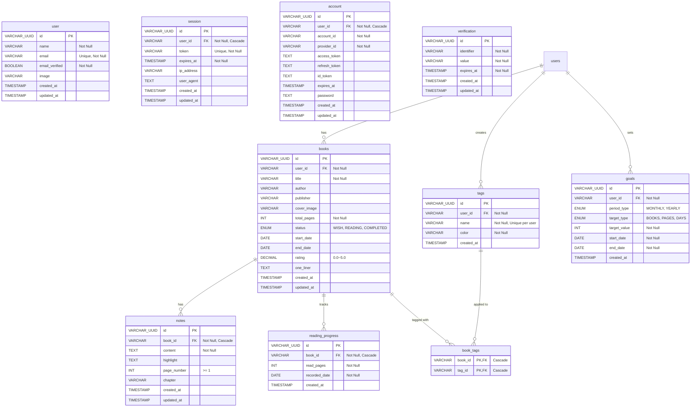

# 기술 요구사항 정의서 (TRD) — ReadLog

## 1. 시스템 개요

본 문서는 사용자가 독서 활동을 기록하고 관리할 수 있는 개인 독서 관리 웹 서비스 'ReadLog'의 기술 요구사항을 정의합니다. 앞서 정의된 PRD를 바탕으로 Next.js와 MariaDB를 활용한 풀스택 애플리케이션의 아키텍처, 데이터베이스 스키마, API 설계 및 기술적 의사결정을 명시합니다.

---

## 2. 기술 스택 (Tech Stack)

- **프론트엔드 & 백엔드 (Full-stack Framework):** Next.js (App Router 권장)
    - React 기반의 UI 구성, Server Actions 및 Route Handlers를 이용한 API 통신 및 비즈니스 로직 처리.
- **데이터베이스 (Database):** MariaDB
    - 관계형 데이터베이스를 통해 사용자, 책, 노트, 태그 등의 복잡한 데이터 관계를 안정적으로 관리.
- **ORM (Object-Relational Mapping):** Drizzle
    - 타입 안정성을 보장하며 MariaDB와의 효율적인 상호작용 및 스키마 마이그레이션 수행.
- **인증 (Authentication):** Better Auth
    - 이메일/비밀번호 기반의 Credential 인증 제공 및 세션 관리.
- **스타일링 (Styling):** Tailwind CSS
    - 반응형 UI 및 디자인 시스템의 빠른 구현.
- **비밀번호 암호화:** `bcrypt` 활용.

---

## 3. 시스템 아키텍처

1.  **Client (Browser):** Next.js의 React Server Components (RSC) 및 Client Components 혼합 사용으로 렌더링 최적화.
2.  **Server (Next.js Node.js Runtime):**
    - 데이터 검증 (Zod 등 활용).
    - Better Auth를 통한 라우트 보호(Middleware 활용).
    - Server Actions를 통한 DB 직접 조작(등록, 수정, 삭제 로직).
3.  **Database (MariaDB):** 영속성 데이터 저장소.

### 3.1 프론트엔드 페이지 구조 (Page Structure)

---

## 4. 데이터베이스 스키마 (Entity Relationship)

MariaDB 테이블 구조 설계입니다.

### 4.1 Better Auth 연동 테이블 (`user`, `session`, `account`, `verification`)

- **`user`**
  - `id` (VARCHAR/UUID, PK)
  - `name` (VARCHAR, Not Null)
  - `email` (VARCHAR, Unique, Not Null)
  - `email_verified` (BOOLEAN, Not Null)
  - `image` (VARCHAR)
  - `created_at` (TIMESTAMP)
  - `updated_at` (TIMESTAMP)
- **`session`**: 사용자 세션 정보
- **`account`**: 소셜 로그인 연동 정보
- **`verification`**: 이메일 등 인증 정보

### 4.2 `books`

- `id` (VARCHAR/UUID, PK)
- `user_id` (VARCHAR, FK -> users.id, Not Null)
- `title` (VARCHAR, Not Null)
- `author` (VARCHAR)
- `publisher` (VARCHAR)
- `cover_image` (VARCHAR) - 이미지 URL
- `total_pages` (INT, Not Null) - 0보다 커야 함
- `status` (ENUM: 'WISH', 'READING', 'COMPLETED', Not Null, Default: 'WISH')
- `start_date` (DATE)
- `end_date` (DATE) - `status`가 'COMPLETED'일 때 필요
- `rating` (DECIMAL(2,1)) - 0.0 ~ 5.0 (0.5 단위)
- `one_liner` (TEXT)
- `created_at` (TIMESTAMP)
- `updated_at` (TIMESTAMP)

### 4.3 `notes`

- `id` (VARCHAR/UUID, PK)
- `book_id` (VARCHAR, FK -> books.id, Not Null, On Delete Cascade)
- `content` (TEXT, Not Null) - 빈 내용 저장 불가
- `highlight` (TEXT) - 인상 깊은 문장
- `page_number` (INT) - 1 이상
- `chapter` (VARCHAR)
- `created_at` (TIMESTAMP)
- `updated_at` (TIMESTAMP)

### 4.4 `reading_progress` (독서 진행률 및 캘린더용)

- `id` (VARCHAR/UUID, PK)
- `book_id` (VARCHAR, FK -> books.id, Not Null, On Delete Cascade)
- `read_pages` (INT, Not Null) - 현재 읽은 페이지 수
- `recorded_date` (DATE, Not Null) - 독서 활동 발생일
- `created_at` (TIMESTAMP)

### 4.5 `tags`

- `id` (VARCHAR/UUID, PK)
- `user_id` (VARCHAR, FK -> users.id, Not Null)
- `name` (VARCHAR, Not Null) - 대소문자 구분 없이 중복 불가
- `color` (VARCHAR, Not Null) - 태그 색상 (Hex 코드 등)
- `created_at` (TIMESTAMP)
- _Constraint:_ `UNIQUE(user_id, LOWER(name))`

### 4.6 `book_tags` (다대다 관계 매핑)

- `book_id` (VARCHAR, FK -> books.id, On Delete Cascade)
- `tag_id` (VARCHAR, FK -> tags.id, On Delete Cascade)
- _Constraint:_ `PRIMARY KEY (book_id, tag_id)`

### 4.7 `goals`

- `id` (VARCHAR/UUID, PK)
- `user_id` (VARCHAR, FK -> users.id, Not Null)
- `period_type` (ENUM: 'MONTHLY', 'YEARLY', Not Null)
- `target_type` (ENUM: 'BOOKS', 'PAGES', 'DAYS', Not Null)
- `target_value` (INT, Not Null)
- `start_date` (DATE, Not Null)
- `end_date` (DATE, Not Null)
- `created_at` (TIMESTAMP)
- _Constraint:_ 동일 기간(start_date, end_date), 동일 타입(target_type) 중복 방지.

---

## 5. 주요 API 명세 및 처리 로직

Next.js Server Actions 또는 API Routes(`/api/*`)를 활용합니다. 모든 엔드포인트는 로그인(세션) 검증을 거칩니다.

### 5.1 Auth API

- `POST /api/auth/register`: 이메일 중복 체크 및 비밀번호 해싱(`bcrypt`) 후 `users` 생성.
- `POST /api/auth/*` (Better Auth): 로그인 처리 및 세션 관리.

### 5.2 Book API

- `POST /api/books`: 새 책 등록. 유효성 검사 (제목 필수, 페이지 수 > 0, 평점 0.5 단위).
- `GET /api/books`: 서재 목록 조회. 쿼리 파라미터(`status`, `search`, `tag`, `sort`)를 통한 필터링/정렬 제공. 페이징 처리.
- `PUT /api/books/[id]`: 책 정보 수정.
- `DELETE /api/books/[id]`: 책 삭제. (Hard Delete: 연관된 notes, reading_progress, book_tags 자동 삭제).

### 5.3 Note & Progress API

- `POST /api/books/[id]/notes`: 노트 등록. 본문(content) 필수 검증.
- `POST /api/books/[id]/progress`: 독서 진행률(현재 읽은 페이지) 기록. `reading_progress` 테이블에 해당 날짜 기록 추가/업데이트. (진행률 로직: `read_pages / total_pages * 100`)

### 5.4 Tag API

- `POST /api/tags`: 태그 생성. `name`을 소문자로 변환하여 해당 사용자의 기존 태그와 중복 비교.
- `POST /api/books/[id]/tags`: 책에 태그 매핑.

### 5.5 Statistics & Goal API

- `GET /api/statistics`: `year`, `month` 파라미터를 받아 조인 쿼리 수행.
    - 완독 책 수: `books`에서 `status='COMPLETED'` 및 `end_date`가 해당 월인 데이터.
    - 페이지 기록: `reading_progress`에서 `recorded_date`가 해당 월인 데이터 합산.
- `POST /api/goals`: 목표 생성. 중복 방지 로직 적용.

---

## 6. 비기능적 기술 요구사항 해결 방안

1.  **보안:**
    - Better Auth의 라우트 보호 기능과 미들웨어(`middleware.ts`)를 사용하여 인증되지 않은 사용자의 `/books`, `/statistics`, `/goals` 등의 경로 접근을 원천 차단.
    - 모든 DB 쿼리 시, `user_id`를 조건으로 포함시켜 타인의 데이터에 접근하는 것을 방지.
2.  **데이터 무결성:**
    - MariaDB의 Foreign Key Constraint (On Delete Cascade)를 활용해 데이터 정합성 유지 및 완전 삭제(Hard Delete) 보장.
    - Zod를 사용해 서버/클라이언트 양측에서 입력값(평점, 페이지 수, 날짜) 유효성을 엄격히 검사.
3.  **확장성:**
    - 책 정보(`books` 테이블)는 현재 수동 입력 구조이지만, 차후 카카오 API 연동 시 `isbn` 필드를 추가하여 외부 데이터와 매핑하기 쉽게 유연한 구조로 둠.
4.  **성능:**
    - `books` 테이블의 `user_id`, `status`, `created_at` 필드 등에 복합 인덱스(Composite Index)를 구성하여 필터링 및 정렬 속도 최적화.
    - 통계 및 캘린더 조회를 위해 `reading_progress`의 `recorded_date` 필드에 인덱스 추가.
